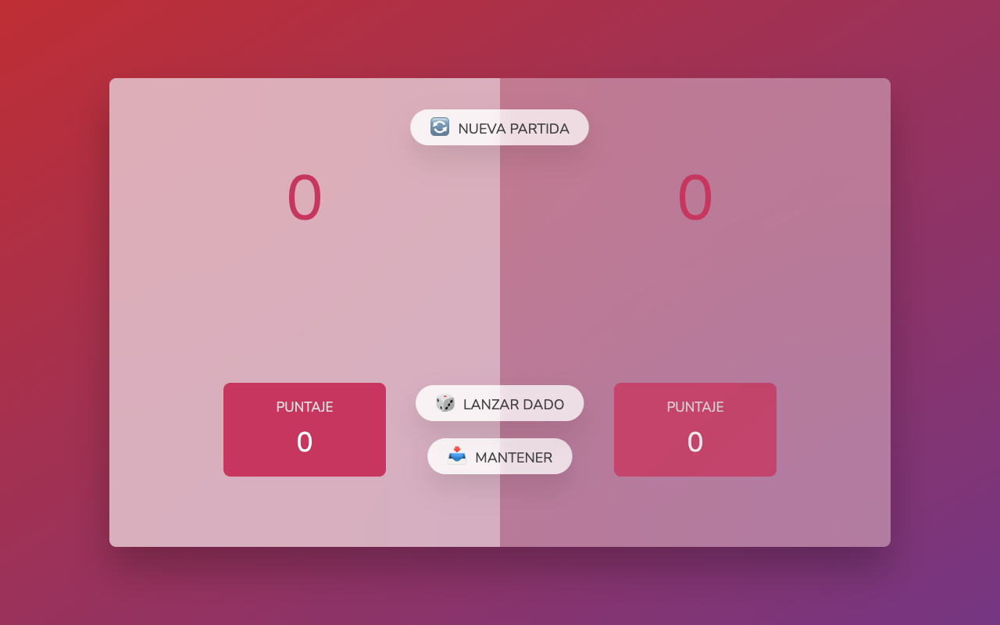

<p align="center">
  <b>🎲 Lanza tu Suerte</b><br>
  <sub>Juego de dados para dos jugadores (Pig) — tirá, guardá y corré hasta los 100 puntos.</sub>
</p>

<p align="center">
  
</p>

<p align="center">
  <a href="https://anthoniriv.github.io/lanzatusuerte/"></a>
  
  
  
  
</p>

---

## Qué hace

Un juego de dados para dos jugadores (la variante «Pig»). Tirás el dado para sumar puntos a tu turno, pero si sacás un **1** perdés lo acumulado. Podés «guardar» (hold) para bancar tus puntos y pasar el turno. Gana el primero en llegar a **100**.

## Funcionalidades

- Dos jugadores (pide el nombre de cada uno al empezar).
- Puntaje **actual** (turno) y **total** por jugador.
- Turnos alternados automáticamente.
- Tira un 1 → pierde el acumulado del turno y cambia el turno.
- Detección de ganador al llegar a 100.
- Botón de **nueva partida**.
- Cero dependencias: HTML, CSS y JavaScript puro.

## Jugar

**[anthoniriv.github.io/lanzatusuerte](https://anthoniriv.github.io/lanzatusuerte/)** · [Ver código](https://github.com/anthoniriv/lanzatusuerte)

## Cómo se juega

| Acción | Resultado |
|--------|-----------|
| 🎲 **Tirar** | Suma el valor del dado a tu puntaje actual |
| ⚠️ **Sacar un 1** | Pierde el acumulado del turno y pasa el turno |
| ✋ **Guardar** | Banca tu puntaje y pasa el turno |
| 🏆 **Ganar** | Primer jugador en llegar a **100** puntos |

## Uso local

No necesita build:

```bash
npx serve .
```

## Tecnologías

| Capa | Stack |
|------|-------|
| Lógica | JavaScript (vanilla) |
| Estructura | HTML5 |
| Estilos | CSS3 |

---

<p align="center"><sub>Hecho con ❤️ por <a href="https://github.com/anthoniriv">Anthoni Rivera</a></sub></p>
